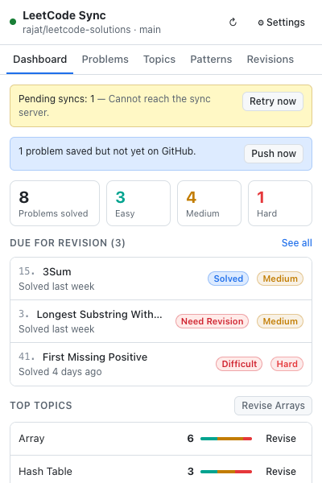
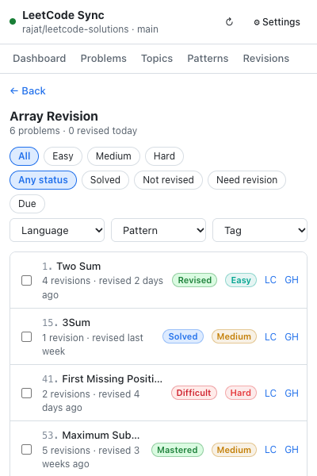
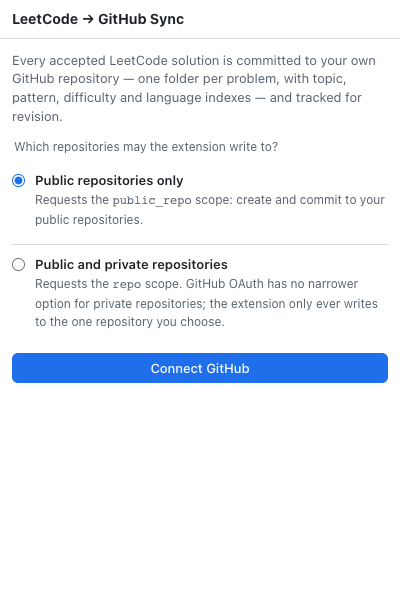
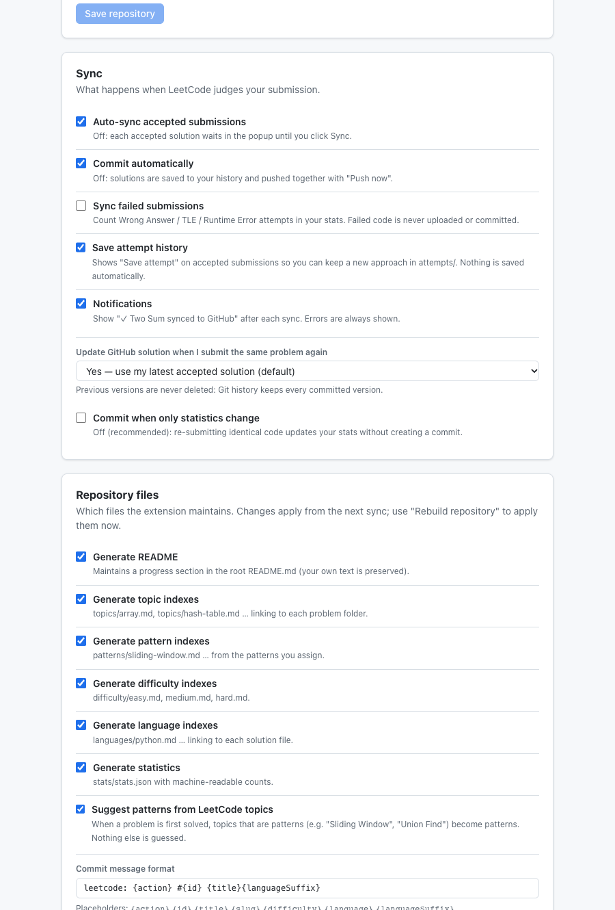
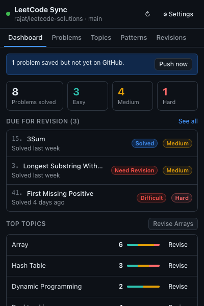
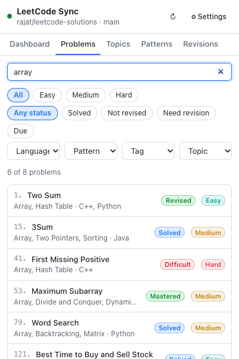
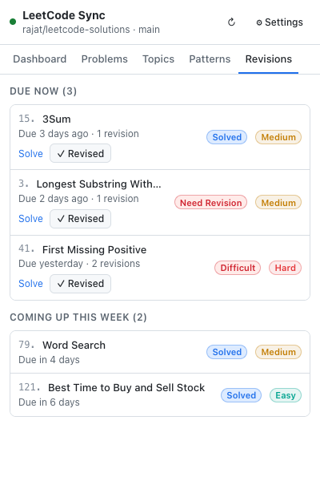
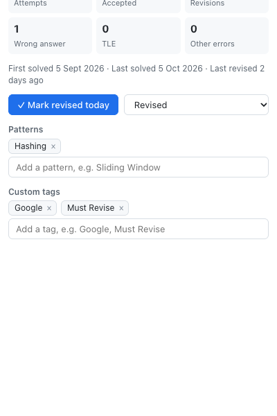

<div align="center">

# LeetCode → GitHub Sync

**Solve on LeetCode. Your GitHub repository maintains itself.**

A Chrome extension that commits every accepted LeetCode solution to a clean, organized GitHub
repository and doubles as your personal DSA revision tracker.



&nbsp;


</div>

---

## Contents

- [What you get](#what-you-get)
- [Quick start](#quick-start)
- [Using the extension](#using-the-extension)
  - [1. Connect GitHub](#1-connect-github)
  - [2. Choose a repository](#2-choose-a-repository)
  - [3. Solve problems on LeetCode](#3-solve-problems-on-leetcode)
  - [4. The dashboard](#4-the-dashboard)
  - [5. Search your problems](#5-search-your-problems)
  - [6. Revise a topic or pattern](#6-revise-a-topic-or-pattern)
  - [7. Revision queue](#7-revision-queue)
  - [8. Edit a problem](#8-edit-a-problem)
- [Settings explained](#settings-explained)
- [What your repository looks like](#what-your-repository-looks-like)
- [How repeated solves are handled](#how-repeated-solves-are-handled)
- [Troubleshooting](#troubleshooting)
- [FAQ](#faq)
- [For developers](#for-developers)

---

## What you get

|                                |                                                                                                                                         |
| ------------------------------ | --------------------------------------------------------------------------------------------------------------------------------------- |
| 🔄 **Automatic sync**          | Submit on LeetCode → **Accepted** → committed to GitHub within seconds.                                                                 |
| 📁 **One folder per problem**  | `problems/0001-two-sum/` holds every language you solved it in. Topics only _link_ to it, never copy it.                                |
| 🏷️ **Topics, patterns & tags** | Official LeetCode topics, your own DSA patterns (Sliding Window, Two Pointers…), and custom tags (Google, Must Revise…), kept separate. |
| 🌐 **Multiple languages**      | Solve Two Sum in Python and C++: one folder, two files.                                                                                 |
| 🔁 **Smart re-submissions**    | Identical code → no commit. Better code → `leetcode: improve #1 Two Sum`, with the old version kept in Git history.                     |
| 🧠 **Revision system**         | Revision counts, statuses (New → Mastered), a "due for revision" list, and a checklist per topic.                                       |
| 🔍 **Search everything**       | Search by number, title, topic, pattern, language, tag or difficulty.                                                                   |
| 🔒 **Public or private repos** | Secure GitHub OAuth; your GitHub token never lives in the browser.                                                                      |
| 📴 **Works offline**           | No connection? Solutions are queued and retried automatically, with no duplicates.                                                      |

---

## Quick start

> Requires **Node.js 22.18+**, **Chrome 111+**, and a free GitHub account.
> A database is optional for local use: an embedded one is built in.

```bash
# 1. Install
git clone <this-repo> && cd LEETCODE_EXTENSION
npm install

# 2. Configure the server
cp backend/.env.example backend/.env
openssl rand -base64 32          # paste the output into TOKEN_ENCRYPTION_KEY
```

**3. Create a GitHub OAuth App** at
[github.com/settings/developers](https://github.com/settings/developers) → _OAuth Apps_ → _New OAuth App_:

| Field                      | Value                                               |
| -------------------------- | --------------------------------------------------- |
| Homepage URL               | `http://localhost:4000`                             |
| Authorization callback URL | `http://localhost:4000/api/v1/auth/github/callback` |

Copy the **Client ID** and a new **Client secret** into `backend/.env`. To skip installing
Postgres, also set:

```bash
DATABASE_URL=pglite://./.data/dev-db
```

```bash
# 4. Start the server (keep this running)
npm run dev -w @lcsync/backend

# 5. Build the extension
npm run build -w @lcsync/extension
```

**6. Load it in Chrome:**

1. Open `chrome://extensions`.
2. Turn on **Developer mode** (top right).
3. Click **Load unpacked** and select the `extension/dist` folder.
4. Pin the extension from the 🧩 puzzle menu so its icon is always visible.

The settings page opens automatically. Continue with [Using the extension](#using-the-extension).

---

## Using the extension

### 1. Connect GitHub



Click the extension icon, then **Connect GitHub**. First choose what the extension may access:

- **Public repositories only.** Requests GitHub's `public_repo` permission.
- **Public and private repositories.** Requests `repo`, which is the only GitHub permission that
  covers private repositories. The extension still only ever writes to the one repository you
  pick.

The extension then shows a one-time sign-in link with two ways to use it:

- **Open GitHub sign-in** opens it in a new tab of this browser.
- **Copy link** lets you paste it into **another browser or Chrome profile**, for example the
  one where you're logged in to GitHub.

The link page shows a short code (like `4F1A-9C2E`). Check that it matches the code in the
extension, click **Continue to GitHub** and approve. The extension notices within a few seconds
and signs you in, even if you closed the popup meanwhile. Links work once and expire after 15
minutes; if you deny access by mistake, just open the same link again.

You can change this later: **Settings → GitHub account → Reconnect / change access**.

<br clear="right" />

### 2. Choose a repository

Open **⚙ Settings** (from the popup header) → **Repository**:

- **Use an existing repository**: pick any repository you can push to, then a branch.
- **Create a new repository**: enter a name (e.g. `leetcode-solutions`) and choose
  public or private.
- **Root folder (optional)**: keep solutions in a sub-folder, e.g. `leetcode/`, if the
  repository also contains other things.

Click **Save repository**. If you already have synced problems, you'll be offered
**Write now** to copy them all into the new repository in a single commit.

<p align="center"></p>

### 3. Solve problems on LeetCode

Just use LeetCode normally. When a submission is **Accepted**:

1. The extension reads your submitted code and the problem details (number, title, difficulty,
   topics).
2. It sends them to your sync server.
3. One commit is created, for example `leetcode: add #1 Two Sum`.
4. A notification appears: **✓ Two Sum synced to GitHub**. Click it to open the commit.

| You did…                                | What happens on GitHub                                                   |
| --------------------------------------- | ------------------------------------------------------------------------ |
| Solved a new problem                    | `leetcode: add #1 Two Sum`                                               |
| Solved it again with **different** code | `leetcode: improve #1 Two Sum`                                           |
| Solved it again with **identical** code | No commit; your attempt and revision counts still go up                  |
| Solved it in a **new language**         | `leetcode: add #1 Two Sum (C++)` and a new file in the same folder       |
| Got Wrong Answer / TLE                  | Nothing, unless _Sync failed submissions_ is on (stats only, never code) |
| Clicked **Run** (not Submit)            | Ignored                                                                  |

> 💡 The extension icon shows a badge number when syncs are waiting, for example while
> you're offline. A failed sync is retried automatically up to **5 times** with growing pauses
> (30s, 1m, 2m, 4m). After that it waits in the popup until you press **Retry**.

### 4. The dashboard


Click the extension icon. The header shows your repository and a status dot:
🟢 ready · 🟡 no repository chosen · 🔴 GitHub needs reconnecting.

The dashboard shows:

- **Alerts**: pending syncs (with **Retry now**), anything that needs your attention, and
  problems saved but not yet on GitHub (with **Push now**).
- **Problems solved**: total, plus Easy / Medium / Hard.
- **Due for revision**: the problems you should revisit next.
- **Top topics & patterns**: counts with a difficulty bar and a **Revise** button each.
- **Recent syncs**: what was committed, with links to each commit.

Prefer dark mode? The extension follows your system theme.

<br clear="right" />

<p align="center"></p>

### 5. Search your problems



The **Problems** tab searches everything you've solved. Try:

| Type             | Finds                            |
| ---------------- | -------------------------------- |
| `1` or `#1`      | Problem number 1 (exact)         |
| `two sum`        | By title                         |
| `array`          | Every Array problem              |
| `sliding window` | Every problem with that pattern  |
| `google`         | Every problem you tagged Google  |
| `python`, `c++`  | Problems solved in that language |
| `medium`         | By difficulty                    |

Narrow the results with the chips (**Easy / Medium / Hard**, **Solved / Not revised /
Need revision / Due**) and the **Language, Pattern, Tag, Topic** menus.

<br clear="right" />

### 6. Revise a topic or pattern


Click **Revise Arrays** on the dashboard, or pick any topic in **Topics** or any pattern in
**Patterns**. You get every problem in that category, with the same filters.

- **Tick the checkbox** after revising a problem. This records a revision for today.
- **LC** opens the problem on LeetCode so you can solve it again.
- **GH** opens your saved solution on GitHub.
- Click a title to open the full problem page.

**Not revised** shows problems you've solved only once: a good place to start.

<br clear="right" />

### 7. Revision queue



The **Revisions** tab lists what's **Due now** and what's **Coming up this week**.

A problem becomes due again a set time after you last solved or revised it, based on its
status:

| Status        | Due again after |
| ------------- | --------------- |
| Need Revision | immediately     |
| Difficult     | 3 days          |
| New / Solved  | 7 days          |
| Revised       | 14 days         |
| Mastered      | 60 days         |

Press **✓ Revised** when you've gone over a problem, or **Solve** to retry it on LeetCode.
Solving it again counts as a revision automatically.

<br clear="right" />

### 8. Edit a problem



Click any problem to see its attempts, accepted submissions, wrong answers and revisions.
You can also add your own information:

- **Status**: New, Solved, Revised, Need Revision, Difficult or Mastered.
- **Patterns**: e.g. _Sliding Window_, _Two Pointers_ (suggestions appear as you type).
- **Custom tags**: e.g. _Google_, _Must Revise_, _Weak Topic_.
- **Time / space complexity**: shown in the problem's README _only if you enter it_. The
  extension never guesses complexity.
- **Notes**: published in the problem's README.

Click **Save changes**. GitHub is updated in one commit (`leetcode: update #1 Two Sum`).
Official LeetCode topics can't be edited, so they stay accurate.

**Save an attempt:** with _Save attempt history_ on in Settings, each accepted submission has
a **Save attempt** button. Mark it **New approach** or **Important**, and it's kept as
`attempts/2026-10-01-python.py` next to your main solution. Normal submissions never clutter
your repository.

<br clear="right" />

---

## Settings explained

### Sync

| Setting                                    | Default | What it does                                                                                         |
| ------------------------------------------ | :-----: | ---------------------------------------------------------------------------------------------------- |
| Auto-sync accepted submissions             |   ✅    | Off: each accepted solution waits in the popup until you click **Sync**.                             |
| Commit automatically                       |   ✅    | Off: solutions are saved and pushed together when you click **Push now**.                            |
| Sync failed submissions                    |   ❌    | Counts Wrong Answer / TLE / errors in your stats. Failed code is **never** uploaded.                 |
| Save attempt history                       |   ❌    | Shows the **Save attempt** button on accepted submissions.                                           |
| Notifications                              |   ✅    | "✓ Two Sum synced to GitHub" after each sync. Errors always show.                                    |
| Update GitHub solution when I submit again | Latest  | _Latest_ (default), _Only if faster_, or _Keep my first solution_. Old versions stay in Git history. |
| Commit when only statistics change         |   ❌    | On: identical re-submissions also commit updated counts.                                             |

### What to upload

Choose **Questions and solutions** (recommended) or **Solutions only**. With questions, each
problem README starts with the full LeetCode question: description, examples, constraints and
images. Premium (paid-only) questions are only uploaded to private repositories. After changing
this, click **Update now** to apply it to problems already on GitHub.

### Repository files

Turn each of these on or off: **README**, **topic**, **pattern**, **difficulty** and
**language indexes**, **statistics**, and **Suggest patterns from LeetCode topics**. That last
one turns topics that _are_ patterns, like "Sliding Window", into patterns automatically.

**Commit message format** uses placeholders `{action} {id} {title} {slug} {difficulty}
{language} {languageSuffix}` and shows a live preview. The default is
`leetcode: {action} #{id} {title}{languageSuffix}`.

### Queue & maintenance

- **Retry pending now**: resend anything waiting in the offline queue.
- **Push unsynced problems**: commit everything saved but not yet on GitHub.
- **Rebuild repository**: regenerate every README and index in one commit. Use it after
  changing the settings above. Your own files are never touched.

---

## What your repository looks like

```
leetcode-solutions/
├── README.md                       ← progress & topic tables (your own text is kept)
├── problems/
│   ├── 0001-two-sum/
│   │   ├── README.md               ← problem description, links, all solutions, your notes
│   │   ├── metadata.json           ← counts, dates, topics, patterns, tags
│   │   └── solutions/
│   │       ├── python.py
│   │       └── cpp.cpp
│   └── 0079-word-search/ …
├── topics/      array.md · hash-table.md · backtracking.md · README.md
├── patterns/    sliding-window.md · two-pointers.md · README.md
├── difficulty/  easy.md · medium.md · hard.md
├── languages/   python.md · cpp.md · README.md
└── stats/       stats.json
```

A topic page such as `topics/array.md` looks like this:

```markdown
# Array

Total Problems: 83

## Easy (31)

- [1. Two Sum](../problems/0001-two-sum/)
- [121. Best Time to Buy and Sell Stock](../problems/0121-best-time-to-buy-and-sell-stock/)

## Medium (45)

- [15. 3Sum](../problems/0015-3sum/)
```

**Word Search** has five topics, so it appears in five topic pages, but its code exists in
exactly **one** folder.

---

## How repeated solves are handled

Say you solve **Two Sum** ten times:

- There is still exactly **one** folder: `problems/0001-two-sum/`.
- `solutions/python.py` holds your latest accepted code (or follows the policy you chose).
- Attempt, accepted, wrong-answer and revision counts are all tracked.
- A commit is created only when the code actually changed. Git history keeps every previous
  version, so nothing is ever lost.
- Several accepted submissions within 12 hours count as **one** revision session.

---

## Troubleshooting

| Message / symptom                                                | What to do                                                                                                                |
| ---------------------------------------------------------------- | ------------------------------------------------------------------------------------------------------------------------- |
| **"GitHub authorization has expired. Please reconnect GitHub."** | Popup → **Reconnect**, or Settings → _Reconnect / change access_. Queued syncs resume automatically.                      |
| **"Repository not found…"**                                      | The repository was deleted or made private. Pick another one, or reconnect with private access.                           |
| **"Branch "x" does not exist"**                                  | Choose another branch in Settings → Repository.                                                                           |
| **"GitHub rate limit reached. Sync will resume…"**               | Nothing to do: the sync retries automatically at the time shown.                                                          |
| **"Cannot reach the sync server"**                               | Make sure the server is running (`npm run dev -w @lcsync/backend`). Solutions stay queued meanwhile.                      |
| **"Could not sync … Gave up after 5 tries"**                     | Fix the cause shown in the message, then press **Retry** in the popup (it gets 5 fresh tries).                            |
| **"Could not extract the submitted code"**                       | Reload the LeetCode page and submit again. LeetCode may have changed its page; please open an issue.                      |
| Nothing happens after Accepted                                   | Check that the extension is enabled and that you used **Submit**, not **Run**. Open the popup and look for pending items. |
| **"The sync server does not accept this extension (ID …)"**      | Add that ID (also shown in `chrome://extensions`) to `ALLOWED_EXTENSION_IDS` in `backend/.env` and restart the server.    |
| **"The sign-in link expired"** / **"already used"**              | Click **Connect GitHub** again for a fresh link.                                                                          |
| **"The GitHub sign-in page could not be loaded"**                | The server is up but the GitHub step failed: check the server logs and the OAuth app's client ID and callback URL.        |
| Private repository missing from the list                         | Reconnect and choose **Public and private repositories**.                                                                 |

---

## FAQ

**Will it overwrite my repository's README?**
No. It only manages the section between `<!-- leetcode-sync:start -->` and
`<!-- leetcode-sync:end -->`. Everything else you write stays.

**Can I sync into a repository that already has other content?**
Yes. Set a **Root folder** such as `leetcode/` and everything goes inside it.

**What if I switch to another repository or branch?**
Choose **Write now** after saving, or simply keep solving: everything you've synced before is
added with your next commit.

**Does it upload anything besides my solutions?**
No browsing data, no other sites. See _Settings → Privacy_ or
[docs/SECURITY.md](docs/SECURITY.md) for exactly what is stored where.

**Does it work for LeetCode premium or contest problems?**
Yes. Problems with non-numeric IDs get folders like `lcp-01-<slug>/`.

**Is my GitHub token safe?**
It never reaches the browser. It's stored encrypted on the sync server, and
**Disconnect GitHub** revokes it at GitHub immediately.

---

## For developers

| Path               | What                                                                                                                                                       |
| ------------------ | ---------------------------------------------------------------------------------------------------------------------------------------------------------- |
| `extension/`       | Chrome extension: MV3, React, Vite. Detection, offline queue, popup, settings                                                                              |
| `backend/`         | Express + PostgreSQL: OAuth, sync, repository generation, revisions, stats                                                                                 |
| `packages/shared/` | Rules and API contracts shared by both                                                                                                                     |
| `docs/`            | [Architecture](docs/ARCHITECTURE.md) · [API](docs/API.md) · [Database](docs/DATABASE.md) · [Security](docs/SECURITY.md) · [Deployment](docs/DEPLOYMENT.md) |

| Command                            |                                                                         |
| ---------------------------------- | ----------------------------------------------------------------------- |
| `npm test`                         | All 168 tests: shared, backend (real Postgres via PGlite) and extension |
| `npm run typecheck`                | Strict TypeScript everywhere                                            |
| `npm run lint` / `npm run format`  | ESLint / Prettier                                                       |
| `npm run build`                    | Backend bundle + extension build                                        |
| `npm run dev -w @lcsync/extension` | Rebuild the extension on every change                                   |
| `docker compose up -d`             | Local PostgreSQL (alternative to `pglite://`)                           |

**Pointing the extension at a deployed server:**

```bash
VITE_API_BASE_URL=https://your-server.example.com npm run package -w @lcsync/extension
```

This produces `extension/release/lcsync-1.0.0.zip`, ready for the Chrome Web Store. Production
setup is in [docs/DEPLOYMENT.md](docs/DEPLOYMENT.md).

**How it works, in four lines:** the extension watches LeetCode's own submit and judge
responses (read-only) → confirms them through LeetCode's API → queues the request in the
browser → the server records it and writes the problem folder, indexes and README as **one
atomic commit**, skipping the commit if nothing changed. Details are in
[docs/ARCHITECTURE.md](docs/ARCHITECTURE.md).
